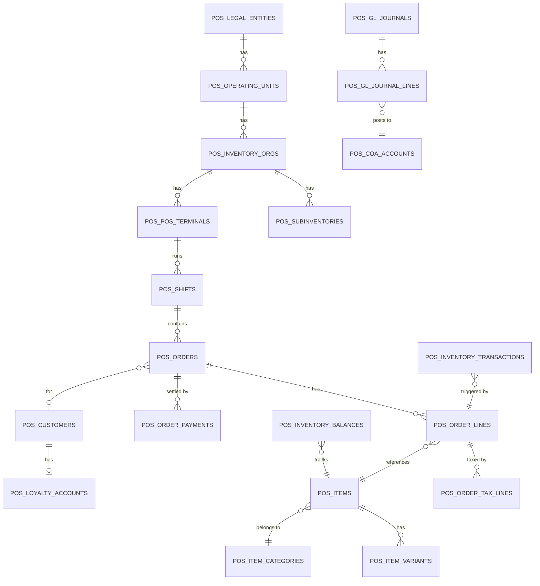

# Enterprise POS & ERP — Oracle APEX/PL/SQL Implementation Plan

> **Architecture** | Multi-Tenant · Multi-Org · Offline-First PWA · EBS-Style Financials  
> **Tech Stack** | Oracle DB 19c+ · Oracle APEX 23.2+ · ORDS · PL/SQL · JavaScript/PWA

---

## Project Folder Structure (`d:\POS\`)

```
d:\POS\
├── ddl\                          ← Phase 1: All DDL Scripts
│   ├── 01_multi_org_setup.sql         (Legal Entity, Orgs, Terminals, Users, VPD)
│   ├── 02_item_master.sql             (Items, Variants, Lots/Serials, UOM, Attributes)
│   ├── 03_pricing_and_promotions.sql  (Price Lists, Promos, Coupons, Loyalty)
│   ├── 04_orders_and_payments.sql     (Customers, Shifts, Orders, Lines, Payments)
│   ├── 05_inventory_transactions.sql  (Balances, Movements, FIFO Layers, Transfers)
│   ├── 06_financials_gl_ar_ap.sql     (COA, GL Journals, AR, AP, Suppliers, POs)
│   ├── 07_tax_engine.sql              (Regimes, Types, Rates, Rules, Exemptions)
│   └── 08_offline_sync_and_audit.sql  (Sync Queue, Conflicts, Audit Log, Settings)
│
├── packages\                     ← Phase 2: PL/SQL Packages
│   ├── PKG_POS_CORE.pks/pkb          (Order engine, pricing, settlement)
│   ├── PKG_TAX_ENGINE.pks/pkb        (Dynamic tax evaluation)
│   ├── PKG_INV_ENGINE.pks/pkb        (Stock transactions, FIFO/Average costing)
│   ├── PKG_ACCOUNTING_ENGINE.pks/pkb (SLA posting, GL distributions)
│   └── PKG_OFFLINE_SYNC.pks/pkb      (Payload processor, idempotency)
│
├── js\                           ← Phase 3: JavaScript / PWA
│   ├── sw.js                          (Service Worker — cache & background sync)
│   ├── idb-manager.js                 (IndexedDB abstraction layer)
│   ├── pos-sync.js                    (Bidirectional sync engine)
│   ├── escpos.js                      (ESC/POS thermal printer utility)
│   └── pos-hardware.js                (Cash drawer, pole display, barcode scanner)
│
├── apex_specs\                   ← Phase 4: APEX UI Specifications
│   ├── page_cashier_terminal.md       (POS terminal — layout, DAs, keyboard map)
│   ├── page_backoffice_admin.md       (Admin screens — Price Lists, GL Dashboard)
│   └── apex_components.md            (Shared components, theme, security)
│
└── docs\
    ├── architecture_overview.md
    └── deployment_guide.md
```

---

## Phase 1 — Database Architecture & DDL Scripts ✅ IN PROGRESS

### Schema Design Principles
| Principle | Implementation |
|-----------|----------------|
| **Normalization** | Full 3NF/BCNF. Lookup/code tables separated. No repeating groups. |
| **Multi-Tenancy** | Every transactional table carries `INV_ORG_ID` for VPD row isolation |
| **Audit Trail** | `CREATED_BY`, `CREATION_DATE`, `LAST_UPDATED_BY`, `LAST_UPDATE_DATE` on all tables |
| **Idempotency** | `OFFLINE_IDEMPOTENCY_KEY` on orders; `IDEMPOTENCY_KEY` on sync queue |
| **Immutability** | `POS_INVENTORY_TRANSACTIONS` and `POS_GL_JOURNAL_LINES` are append-only ledgers |
| **FIFO Costing** | Dedicated `POS_FIFO_COST_LAYERS` for precise first-in-first-out valuation |
| **Virtual Columns** | Used in `POS_CYCLE_COUNT_LINES` for computed variance |

### DDL Files Breakdown

| File | Tables | Description |
|------|--------|-------------|
| `01_multi_org_setup.sql` | 7 | Legal Entities → OUs → Inv Orgs → Subinvs → Terminals + Users + VPD |
| `02_item_master.sql` | 9 | Item Master, Variants, Attributes, Lots/Serials, Org Assignments |
| `03_pricing_and_promotions.sql` | 9 | Price Lists (hierarchical), Promos, Coupons, Loyalty |
| `04_orders_and_payments.sql` | 8 | Customers, Shifts, Cash Movements, F&B Tables, Orders, Payments |
| `05_inventory_transactions.sql` | 7 | Balances, Txn Ledger, FIFO Layers, Inter-Org Transfers, Cycle Counts |
| `06_financials_gl_ar_ap.sql` | 15 | COA Flexfields, GL, AR (Invoices/Receipts), AP (POs/Invoices/Payments) |
| `07_tax_engine.sql` | 6 | Regimes, Tax Types, Rates, Rule Matrix, Exemptions, Order Tax Lines |
| `08_offline_sync_and_audit.sql` | 5 | Sync Queue, Conflict Log, Audit Log, App Settings, Print Templates |
| **TOTAL** | **66 tables** | |

---

## Phase 2 — PL/SQL Business Logic Packages 🔜

### PKG_POS_CORE
- `CREATE_ORDER` — Initializes order header with sequence, validates shift
- `ADD_ORDER_LINE` — Applies price list hierarchy, evaluates promotions
- `APPLY_DISCOUNT` — Validates discount against min price limits
- `CALCULATE_TOTALS` — Computes subtotal, discount, tax, rounding
- `SETTLE_ORDER` — Splits tender, updates shift totals, triggers GL posting
- `VOID_ORDER` — Reverses inventory and GL entries
- `RETURN_ORDER` — Creates credit memo, restocks inventory

### PKG_TAX_ENGINE
- `DETERMINE_TAX_RATE` — Rule matrix evaluation with priority ordering
- `CALCULATE_TAX` — Handles inclusive/exclusive, compound taxes
- `WRITE_TAX_LINES` — Inserts into POS_ORDER_TAX_LINES
- `GENERATE_EINVOICE_PAYLOAD` — UBL 2.1 XML / TLV QR structure

### PKG_INV_ENGINE
- `TRANSACT_INVENTORY` — Core depletion/receipt function
- `RESERVE_STOCK` — Creates reservations for orders
- `FIFO_CONSUME_LAYERS` — FIFO layer-by-layer depletion
- `RECALCULATE_AVERAGE_COST` — Moving average recomputation
- `VALIDATE_STOCK` — Real-time availability check
- `PROCESS_TRANSFER` — Inter-org transfer with transit tracking

### PKG_ACCOUNTING_ENGINE
- `POST_SALE_JOURNAL` — Triggers SLA rules for sales
- `POST_COGS_JOURNAL` — COGS + Inventory credit
- `POST_SHIFT_RECONCILIATION` — Over/short journal
- `POST_AR_RECEIPT` — AR application journal
- `POST_AP_PAYMENT` — AP disbursement journal

### PKG_OFFLINE_SYNC
- `PROCESS_PAYLOAD` — JSON parsing + idempotency check
- `APPLY_ORDER_PAYLOAD` — Deserializes offline order → creates DB records
- `DETECT_CONFLICTS` — Compares client vs server state
- `RESOLVE_CONFLICT` — Applies resolution strategy

---

## Phase 3 — PWA, IndexedDB & Hardware JS 🔜

| File | Responsibility |
|------|----------------|
| `sw.js` | Cache-first for static assets, network-first for ORDS APIs, Background Sync API |
| `idb-manager.js` | IndexedDB stores: `items`, `priceLists`, `customers`, `offlineQueue`, `settings` |
| `pos-sync.js` | Bidirectional sync: pull master data, push offline transactions |
| `escpos.js` | Full ESC/POS command builder: text, bold, barcode, QR, cut, drawer kick |
| `pos-hardware.js` | Web Serial/USB port management, pole display protocol, cash drawer trigger |

---

## Phase 4 — Oracle APEX UI/UX Design 🔜

### POS Cashier Terminal (Page 100)
- **Left Panel:** Item grid (tiles) with category tabs — touch-first
- **Right Panel:** Order lines (Interactive Report), running total card
- **Bottom Bar:** Keyboard shortcut legend (F1-F12 mapping)
- **Modal Dialogs:** Payment modal, discount modal, customer search
- **Dynamic Actions:** Barcode scan → auto-add line, real-time total recalculation

### Keyboard Shortcut Map
| Key | Action |
|-----|--------|
| `F1` | New Order |
| `F2` | Search Item / Scan Mode |
| `F3` | Customer Lookup |
| `F4` | Apply Discount |
| `F5` | Hold Order |
| `F6` | Recall Held Order |
| `F7` | Void Line |
| `F8` | Void Order |
| `F9` | Return/Refund |
| `F10` | Open Cash Drawer |
| `F11` | Print Receipt |
| `F12` | **Payment / Settle** |
| `Esc` | Cancel / Back |
| `Enter` | Confirm |
| `+/-` | Qty adjustment |

---

## VPD Security Architecture

```sql
-- Context set on login (set by APEX auth scheme post-login process)
DBMS_SESSION.SET_CONTEXT('POS_CTX', 'APP_USER_ID',    :APP_USER_ID);
DBMS_SESSION.SET_CONTEXT('POS_CTX', 'INV_ORG_ID',     :USER_INV_ORG_ID);
DBMS_SESSION.SET_CONTEXT('POS_CTX', 'USER_ROLE',       :USER_ROLE);

-- VPD Policy on transactional tables
FUNCTION pos_security_policy(schema IN VARCHAR2, obj IN VARCHAR2) RETURN VARCHAR2 IS
BEGIN
  IF SYS_CONTEXT('POS_CTX','USER_ROLE') = 'SYSADMIN' THEN RETURN NULL; END IF;
  RETURN 'INV_ORG_ID IN (SELECT INV_ORG_ID FROM POS_USER_ORG_ACCESS 
                          WHERE APP_USER_ID = SYS_CONTEXT(''POS_CTX'',''APP_USER_ID''))';
END;
```

---

## Entity Relationship Summary


