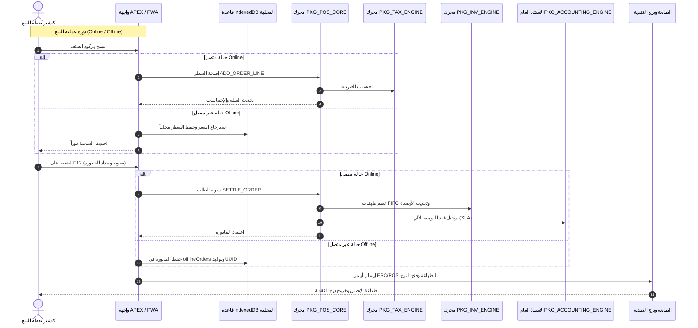

# 📚 الموسوعة المعمارية الشاملة لنظام Enterprise POS & ERP Suite
## Exhaustive Step-by-Step Architecture & Database Objects Deep-Dive (Phases 1 - 4)

---

# 🏛️ المرحلة الأولى: بنية قاعدة البيانات (Phase 1 — Database Architecture)

تتكون بنية قاعدة البيانات من **66 جدولاً** موزعة على 8 ملفات DDL متوافقة مع Oracle 12c/19c/23c ومصممة وفق معايير Oracle E-Business Suite (EBS):

---

## 1.1 وحدة الهيكل الإداري والأمني (Multi-Org & VPD Security)
ملف التثبيت: `ddl/01_multi_org_setup.sql`

```
[POS_LEGAL_ENTITIES] (SEQ_LEGAL_ENTITY_ID)
       └── [POS_OPERATING_UNITS] (SEQ_ORG_UNIT_ID)
              └── [POS_INVENTORY_ORGS] (SEQ_INV_ORG_ID)
                     ├── [POS_SUBINVENTORIES] (SEQ_SUBINV_ID)
                     └── [POS_POS_TERMINALS] (SEQ_TERMINAL_ID)
```

### 1. `POS_LEGAL_ENTITIES` (الكيان القانوني)
* **الوظيفة:** يمثل الشركة المسجلة قانونياً وضريبياً والتي يُصدر باسمها القوائم المالية الموحدة والإقرارات الضريبية.
* **الأعمدة والمفاتيح:**
  * `LEGAL_ENTITY_ID` (PK): رقم المعرف الفريد عبر تسلسل `SEQ_LEGAL_ENTITY_ID` (يبدأ من `1000001`).
  * `LEGAL_ENTITY_CODE` (UK): كود الشركة الفريد (مثل `CORP_SA`).
  * `TAX_REGISTRATION_NO`: الرقم الضريبي المطبوع على الفواتير الإلكترونية (15 رقماً في ZATCA).
  * `CURRENCY_CODE`: عملة الأساس المحاسبية (مثل `SAR`, `USD`).
  * `FISCAL_YEAR_START_MONTH`: شهر بداية السنة المالية (1-12) لضبط الفترات المحاسبية.
* **القيود والفهارس:** قيد تحقق `POS_LE_ACTIVE_CHK`، وقيد شهر البداية `POS_LE_MONTH_CHK`، وفهرس `POS_LE_COUNTRY_IDX`.

### 2. `POS_OPERATING_UNITS` (وحدات التشغيل)
* **الوظيفة:** الإدارة التشغيلية أو المكتب الإقليمي المشرف على مجموعة من الفروع أو المخازن.
* **الأعمدة والمفاتيح:**
  * `ORG_UNIT_ID` (PK): عبر `SEQ_ORG_UNIT_ID`.
  * `LEGAL_ENTITY_ID` (FK): يربط وحدة التشغيل بالشركة المالكة.
  * `ORG_TYPE`: نوع الوحدة (`HQ` مركز رئيسي، `BRANCH` فرع، `WAREHOUSE` مستودع إقليمي، `FRANCHISE` امتياز).
* **القيود والفهارس:** `POS_OU_TYPE_CHK`، وفهرس `POS_OU_LE_IDX`.

### 3. `POS_INVENTORY_ORGS` (المؤسسات المخزنية والفروع)
* **الوظيفة:** الكيان الأساسي لعزل البيانات التشغيلية والمخزنية ومحور تطبيق الـ VPD.
* **الأعمدة والمفاتيح:**
  * `INV_ORG_ID` (PK): عبر `SEQ_INV_ORG_ID`.
  * `ORG_UNIT_ID` (FK): التبعية الإدارية لوحدة التشغيل.
  * `PARENT_INV_ORG_ID` (Self-ref FK): تسلسل هرمي للمستودعات الفرعية التابعة لفرع رئيسي.
  * `ORG_CATEGORY`: تصنيف المكان (`STORE`, `WAREHOUSE`, `KITCHEN`, `VENDING`).
  * `SECTOR_TYPE`: قطاع النشاط (`RETAIL`, `FNB`, `SERVICE`, `HYBRID`).
  * `COSTING_METHOD`: طريقة تقييم المخزون (`FIFO`, `AVERAGE`, `STANDARD`).
* **القيود والفهارس:** `POS_IO_SECTOR_CHK`، `POS_IO_COSTING_CHK`، وفهارس على الـ FKs.

### 4. `POS_SUBINVENTORIES` (المواقع التخزينية الداخلية)
* **الوظيفة:** تقسيم مساحات التخزين داخل الفرع الواحد.
* **الأعمدة والمفاتيح:**
  * `SUBINV_ID` (PK): عبر `SEQ_SUBINV_ID`.
  * `INV_ORG_ID` (FK): الفرع التابع له.
  * `SUBINV_TYPE`: نوع الموقع (`SHELF` رفوف البيع، `BACKSTORE` مستودع خلفي، `TRANSIT` بضاعة في الطريق).
  * `IS_RESERVABLE` & `IS_ASSET_VALUED`: هل البضاعة قابلة للحجز المسبق وهل تدخل في تقييم أصول الشركة المالية.
* **القيود:** قيد فريد مركب `POS_SI_ORG_CODE_UK (INV_ORG_ID, SUBINV_CODE)`.

### 5. `POS_POS_TERMINALS` (أجهزة نقاط البيع)
* **الوظيفة:** سجل تعريفي لكل جهاز كاشير، شاشة خدمة ذاتية (Kiosk)، أو شاشة مطبخ (KDS).
* **الأعمدة والمفاتيح:**
  * `TERMINAL_ID` (PK): عبر `SEQ_TERMINAL_ID`.
  * `PRINTER_IP` & `PRINTER_PORT`: إعدادات الطابعة الحرارية الشبكية (TCP Port 9100).
  * `CASH_DRAWER_ENABLED` & `POLE_DISPLAY_ENABLED`: تفعيل فتح الدرج الآلي وشاشة العميل.

### 6. `POS_APP_USERS` & `POS_USER_ORG_ACCESS` (المستخدمون وصلاحيات الفروع)
* **`POS_APP_USERS`**: ربط مستخدمي APEX بالصلاحيات (`SYSADMIN`, `ORG_ADMIN`, `BRANCH_MANAGER`, `CASHIER`, `AUDITOR`).
* **`POS_USER_ORG_ACCESS`**: مصفوفة صلاحيات الفروع للمستخدمين بنوع الوصول (`FULL`, `READ_ONLY`, `CASHIER_ONLY`).

### 🛡️ كائنات الأمان وعزل البيانات (VPD Security):
* **`POS_CTX`**: سياق التطبيق المباشر (Application Context).
* **`POS_CTX_PKG`**: حزمة PL/SQL لضبط السياق عند تسجيل الدخول (`SET_CONTEXT`).
* **`POS_ORG_SECURITY_POLICY`**: دالة سياسة أمان الـ Row-Level Security التي تحقن شرط `WHERE INV_ORG_ID IN (...)` تلقائياً في استعلامات الجداول الحساسة.

---

## 1.2 وحدة إدارة الأصناف والمخازن (Item Master, Variants & Lot/Serial)
ملف التثبيت: `ddl/02_item_master.sql`

* **`POS_UNITS_OF_MEASURE`**: وحدات القياس ومعاملات التحويل مقارنة بوحدة الأساس.
* **`POS_ITEM_CATEGORIES`**: شجرة المجموعات والتصنيفات اللانهائية وألوان الأزرار.
* **`POS_ITEMS`**: سجل الأصناف الرئيسي (السلع، الخدمات، الوجبات التجميعية BUNDLE، الإضافات MODIFIERS)، ومحددات التتبع (`HAS_VARIANTS`, `HAS_LOT`, `HAS_SERIAL`, `IS_EXPIRY_TRACKED`, `IS_WEIGHABLE`, `IS_OPEN_PRICE`).
* **`POS_ITEM_ATTRIBUTES` & `POS_ATTRIBUTE_VALUES` & `POS_ITEM_VARIANTS`**: مصفوفة المتغيرات (Matrix Variants: المقاس، اللون) وتوليد الـ SKU المستقل.
* **`POS_ITEM_ORG_ASSIGN`**: تعيين الأصناف للفروع وسياسات إعادة الطلب.
* **`POS_LOT_SERIAL_CONTROL`**: إدارة الدفعات وتواريخ الصلاحية وأرقام السيريال.

---

## 1.3 وحدة التسعير، العروض ونقاط الولاء (Pricing, Promos & Loyalty)
ملف التثبيت: `ddl/03_pricing_and_promotions.sql`

* **`POS_PRICE_LISTS` & `POS_PRICE_LIST_LINES`**: جداول الأسعار الهرمية ذات الوراثة التلقائية (`PARENT_PRICE_LIST_ID`) وحدود الحد الأدنى للبيع `MIN_PRICE`.
* **`POS_CUSTOMER_PRICE_LIST`**: ربط فئات العملاء بأسعار خاصة.
* **`POS_PROMOTIONS` & `POS_PROMO_ITEMS`**: محرك العروض الترويجية (`BXGY`, `BUNDLE`, `PERCENT_DISCOUNT`, `FIXED_DISCOUNT`, `THRESHOLD`).
* **`POS_COUPONS`**: قسائم الخصم وتتبع مرات الاستخدام.
* **`POS_LOYALTY_*`**: برامج الولاء، حسابات العملاء، ودفتر أستاذ حركات النقاط (`EARN`, `REDEEM`, `EXPIRE`).

---

## 1.4 وحدة نقاط البيع، الشفتات والدفع (Shifts, Orders & Payments)
ملف التثبيت: `ddl/04_orders_and_payments.sql`

* **`POS_CUSTOMERS`**: العملاء والحدود الائتمانية والأرقام الضريبية.
* **`POS_SHIFTS` & `POS_SHIFT_CASH_MOVEMENTS`**: رقابة ورديات الكاشير، العهدة، والمطابقة العمياء (Blind Close)، وعجز وزيادة الدرج `OVER_SHORT_AMOUNT`.
* **`POS_TABLES`**: تخطيط طاولات صالات قطاع المطاعم والكافيهات.
* **`POS_ORDERS` & `POS_ORDER_LINES`**: فواتير البيع والمرتجع، ومفتاح عدم التكرار الأوفلاين `OFFLINE_IDEMPOTENCY_KEY`.
* **`POS_PAYMENT_METHODS` & `POS_ORDER_PAYMENTS`**: طرق السداد المتعددة والدفع المجزأ (Split Tender).

---

## 1.5 وحدة حركات وتقييم المخزون (Inventory Ledger & FIFO Valuation)
ملف التثبيت: `ddl/05_inventory_transactions.sql`

* **`POS_INVENTORY_BALANCES`**: الأرصدة اللحظية بالمخازن (الفعلي، المحجوز، وفي الطريق).
* **`POS_INVENTORY_TRANSACTIONS`**: دفتر أستاذ حركات المخزون غير القابل للتعديل (Immutable Ledger).
* **`POS_FIFO_COST_LAYERS`**: طبقات التكلفة بنظام الوارد أولاً يصرف أولاً (`LAYER_STATUS`: `OPEN`, `PARTIAL`, `CONSUMED`).
* **`POS_STOCK_TRANSFERS` & `POS_STOCK_TRANSFER_LINES`**: التحويلات بين الفروع وتتبع بضاعة الطريق.
* **`POS_CYCLE_COUNT_*`**: الجرد الدوري وحساب الفروقات آلياً عبر Virtual Generated Columns:
  $$\text{VARIANCE\_QTY} = \text{COUNTED\_QTY} - \text{SYSTEM\_QTY}$$
  $$\text{VARIANCE\_VALUE} = (\text{COUNTED\_QTY} - \text{SYSTEM\_QTY}) \times \text{UNIT\_COST}$$

---

## 1.6 وحدة الحسابات العامة والأستاذ المساعد (Financials GL, SLA, AR & AP)
ملف التثبيت: `ddl/06_financials_gl_ar_ap.sql`

* **`POS_COA_SEGMENTS` & `POS_COA_ACCOUNTS`**: دليل الحسابات المرن Flexfield (Company - Cost Center - Account - Product).
* **`POS_GL_PERIODS`**: الفترات المالية وحالات الإغلاق الشهري والسنوي.
* **`POS_SLA_RULES`**: قواعد الترحيل المحاسبي الآلي للعمليات التشغيلية (Subledger Accounting).
* **`POS_GL_JOURNALS` & `POS_GL_JOURNAL_LINES`**: دفتر اليومية العامة المتوازن.
* **`POS_AR_*` & `POS_AP_*`**: الأستاذ المساعد للعملاء وفواتير وسندات الموردين مع المطابقة الثلاثية 3-Way Matching.

---

## 1.7 وحدة محرك الضرائب والفاتورة الإلكترونية (Tax Engine)
ملف التثبيت: `ddl/07_tax_engine.sql`

* **`POS_TAX_REGIMES` & `POS_TAX_TYPES` & `POS_TAX_RATES`**: الأنظمة والنسب الضريبية.
* **`POS_TAX_RULES` & `POS_TAX_EXEMPTIONS`**: مصفوفة تطبيق الضريبة والإعفاءات بحسب الأولوية.
* **`POS_ORDER_TAX_LINES`**: تفقيط أسطر الضريبة الشاملة وغير الشاملة.

---

## 1.8 وحدة المزامنة الأوفلاين والتدقيق (Offline Sync & Audit Trail)
ملف التثبيت: `ddl/08_offline_sync_and_audit.sql`

* **`POS_OFFLINE_SYNC_QUEUE`**: طابور المزامنة للعمليات القادمة من الـ PWA.
* **`POS_SYNC_CONFLICT_LOG`**: سجل فض النزاعات وتوثيق الاختلافات.
* **`POS_AUDIT_LOG`**: سجل التدقيق الشامل لعمليات الإضافة والتعديل والحذف مع حفظ الـ Old/New Values بتنسيق JSON.
* **`POS_APP_SETTINGS` & `POS_PRINT_TEMPLATES`**: إعدادات النظام وقوالب الطباعة الحرارية ESC/POS.

---

# ⚙️ المرحلة الثانية: تشريح حزم الـ PL/SQL (Phase 2)

تم بناء **5 حزم برمجية متقدمة (2,305 أسطر)**:

---

## 2.1 حزمة محرك نقاط البيع (`PKG_POS_CORE`)
* **ملف المواصفات:** `packages/PKG_POS_CORE.pks` (128 سطر)
* **ملف الجسم:** `packages/PKG_POS_CORE.pkb` (611 سطر)

### 📌 التشريح التفصيلي للإجراءات والدوال:

#### 1. `FUNCTION GENERATE_ORDER_NO(p_inv_org_id IN NUMBER) RETURN VARCHAR2`
* **المدخلات:** معرف الفرع `p_inv_org_id`.
* **المخرجات:** كود الفاتورة النصي (مثل `ORG101-20260831-000042`).
* **الخوارزمية:**
  1. جلب كود الفرع من `POS_INVENTORY_ORGS`.
  2. استعلام عدد فواتير اليوم لنفس الفرع من `POS_ORDERS` وإضافة 1.
  3. تنسيق الرقم باستخدام `LPAD(seq, 6, '0')`.

#### 2. `PROCEDURE CREATE_ORDER(...)`
* **المدخلات:** الفرع، الجهاز، الشفت، الكاشير، نوع الطلب، القطاع، العميل، الطاولة، قائمة الأسعار.
* **المخرجات:** `p_order_id`, `p_order_no`.
* **الخوارزمية وقواعد العمل:**
  1. إنشاء نقطة حفظ `SAVEPOINT create_order_sp`.
  2. استدعاء `validate_shift_open(p_shift_id)` للتأكد من أن الوردية مفتوحة.
  3. إذا كانت `p_price_list_id` فارغة، يتم سحب القائمة الافتراضية للجهاز `POS_POS_TERMINALS.DEFAULT_PRICE_LIST_ID`.
  4. فحص الطاولة (في قطاع المطاعم): قفل سجل الطاولة `FOR UPDATE NOWAIT` والتأكد أن `TABLE_STATUS = 'AVAILABLE'` ثم تحويلها إلى `OCCUPIED`.
  5. إدراج رأس الفاتورة في `POS_ORDERS` بالحالة `DRAFT`.
  6. التعامل مع الأخطاء: `ROLLBACK TO create_order_sp` وإعادة إطلاق الخطأ.

#### 3. `PROCEDURE ADD_ORDER_LINE(...)`
* **المدخلات:** معرف الطلب، معرف الصنف، معرف المتغير (Variant)، الكمية، وحدة القياس، السعر، نسبة الخصم، الملاحظات.
* **المخرجات:** `p_line_id`.
* **الخوارزمية وقواعد العمل:**
  1. التحقق من أن الفاتورة في حالة مسودة `DRAFT`.
  2. فحص الصنف في `POS_ITEMS`: إذا كان `HAS_VARIANTS = 'Y'` ولم يُمرر `p_variant_id`، يرفع استثناء `RAISE_APPLICATION_ERROR(-20202, 'Item requires variant.')`.
  3. فحص السعر: إذا كان السعر المدخل فارغاً، يتم استدعاء `GET_ITEM_PRICE`.
  4. فحص الحد الأدنى: إذا لم يكن الصنف مفتوح السعر (`IS_OPEN_PRICE != 'Y'`) وكان السعر أقل من `MIN_SALE_PRICE`، يرفع استثناء `E_PRICE_BELOW_MIN`.
  5. حساب المبالغ:
     $$\text{Line Subtotal} = \text{Quantity} \times \text{Unit Price}$$
     $$\text{Discount Amount} = \text{Line Subtotal} \times \frac{\text{Discount Pct}}{100}$$
  6. جلب تكلفة الصنف عبر الدالة الخاصة `get_item_cost`.
  7. إدراج السطر في `POS_ORDER_LINES`.
  8. استدعاء `CALCULATE_ORDER_TOTALS` لإعادة احتساب الفاتورة فورياً.

#### 4. `FUNCTION GET_ITEM_PRICE(...) RETURN NUMBER`
* **الخوارزمية (Hierarchy Traversal):**
  1. البحث عن سعر الصنف والمتغير ووحدة القياس في قائمة الأسعار المحددة `p_price_list_id`.
  2. في حالة عدم وجود السعر (`NO_DATA_FOUND`)، يتم الاستعلام عن القائمة الأم `PARENT_PRICE_LIST_ID` من جدول `POS_PRICE_LISTS`.
  3. تكرار البحث في حلقة `WHILE v_curr_list IS NOT NULL LOOP` حتى الوصول لأعلى القائمة الهرمية.
  4. في حال عدم العثور على سعر، يرفع استثناء `E_PRICE_NOT_FOUND`.

#### 5. `PROCEDURE CALCULATE_ORDER_TOTALS(p_order_id IN NUMBER)`
* **الخوارزمية (Saudi Halala Rounding):**
  1. جمع المجموع الفرعي والضريبة للأسطر الفعالة (`LINE_STATUS = 'ACTIVE'`).
  2. قراءة خصم الفاتورة العام `DISCOUNT_AMOUNT`.
  3. حساب الإجمالي المبدئي: $\text{Total} = \text{Subtotal} - \text{Discount} + \text{Tax}$.
  4. تطبيق خوارزمية تقريب الهللات لأقرب 0.05 ريال:
     $$\text{Rounding} = \text{ROUND}\left(\frac{\text{Total}}{0.05}\right) \times 0.05 - \text{Total}$$
     $$\text{Final Total} = \text{Total} + \text{Rounding}$$
  5. تحديث جدول `POS_ORDERS`.

#### 6. `PROCEDURE ADD_PAYMENT(...)`
* **المدخلات:** معرف الفاتورة، طريقة الدفع، المبلغ المدفوع، المرجع، آخر 4 أرقام من البطاقة، كود التفويض.
* **الخوارزمية:**
  1. قفل سجل الفاتورة `FOR UPDATE NOWAIT`.
  2. حساب المتبقي: $\text{Remaining} = \text{Total} - \text{Paid}$.
  3. فحص خاصية إرجاع الباقي `IS_CHANGE_APPLICABLE`: إذا كان المدفوع أكبر من المتبقي والطريقة تدعم الباقي (كاش)، يُحسب الباقي `CHANGE_GIVEN`.
  4. إدراج سجل في `POS_ORDER_PAYMENTS`.
  5. تحديث `PAID_AMOUNT` و `CHANGE_AMOUNT` في `POS_ORDERS` وتحديث الحالة إلى `PAID` أو `PARTIALLY_PAID`.

#### 7. `PROCEDURE SETTLE_ORDER(p_order_id IN NUMBER)`
* **الخوارزمية (End-to-End Orchestration):**
  1. إنشاء نقطة حفظ `SAVEPOINT settle_order_sp`.
  2. قفل الفاتورة والتأكد التام أن $\text{Paid Amount} \ge \text{Total Amount}$.
  3. تحويل حالة الفاتورة إلى `PAID` وتثبيت تاريخ التأكيد `CONFIRMED_DATETIME`.
  4. استدعاء محرك المخزون `PKG_INV_ENGINE.PROCESS_ORDER_INVENTORY(p_order_id)`.
  5. استدعاء محرك الحسابات `PKG_ACCOUNTING_ENGINE.POST_SALE_JOURNAL(p_order_id)`.
  6. تحديث جدول الوردية `POS_SHIFTS`: زيادة `TOTAL_SALES` و `TOTAL_TAX` و `TOTAL_DISCOUNTS`.
  7. فك حجز الطاولة إن وُجدت وتحويلها إلى `AVAILABLE`.

---

## 2.2 حزمة محرك الضرائب الديناميكي (`PKG_TAX_ENGINE`)
* **ملف المواصفات:** `packages/PKG_TAX_ENGINE.pks` (66 سطر)
* **ملف الجسم:** `packages/PKG_TAX_ENGINE.pkb` (282 سطر)

### 📌 التشريح التفصيلي:
* **`DETERMINE_TAX_RATE(...)`**:
  - يمر عبر مؤشر `CURSOR` على `POS_TAX_RULES` و `POS_TAX_RATES` مرتباً بالأولوية `PRIORITY ASC`.
  - يفحص شروط التطابق (العميل، الصنف، المجموعة، الفرع، الشركة).
  - يعيد سجل `t_tax_result` يحتوي على (نسبة الضريبة، كود الضريبة، هل هي شاملة أم غير شاملة، وهل الصنف معفى).
* **`CALCULATE_ORDER_TAX(p_order_id)`**:
  - يمسح أسطر الضريبة السابقة للطلب في `POS_ORDER_TAX_LINES`.
  - يمر على أسطر الفاتورة، ويحدد الضريبة لكل سطر، ويحسب القيمة:
    - **شامل الضريبة:** $\text{Tax} = \text{Amount} \times \frac{\text{Rate}}{100 + \text{Rate}}$
    - **غير شامل الضريبة:** $\text{Tax} = \text{Amount} \times \frac{\text{Rate}}{100}$
  - يدرج الأسطر في `POS_ORDER_TAX_LINES` ويحدث `TAX_AMOUNT` في `POS_ORDER_LINES`.

---

## 2.3 حزمة محرك المخزون والتقييم (`PKG_INV_ENGINE`)
* **ملف المواصفات:** `packages/PKG_INV_ENGINE.pks` (112 سطر)
* **ملف الجسم:** `packages/PKG_INV_ENGINE.pkb` (370 سطر)

### 📌 التشريح التفصيلي:
* **`TRANSACT_INVENTORY(...)`**:
  - يتحقق من توفر الرصيد في حالة البيع (`QUANTITY_ON_HAND - QUANTITY_RESERVED >= p_qty`).
  - في حالة الـ FIFO، يستدعي `FIFO_CONSUME_LAYERS` لتحديد التكلفة الفعلية.
  - يدرج حركة في دفتر الأستاذ المخزني `POS_INVENTORY_TRANSACTIONS`.
  - ينفذ عملية `MERGE INTO POS_INVENTORY_BALANCES` لتحديث الرصيد اللحظي.
* **`FIFO_CONSUME_LAYERS(...)`**:
  - يفتح مؤشر على `POS_FIFO_COST_LAYERS` بالأقدم استلاماً (`ORDER BY RECEIPT_DATE ASC, LAYER_ID ASC`).
  - يخصم الكمية المطلوبة من أقدم طبقة مفتوحة، ويحولها إلى `PARTIAL` أو `CONSUMED`.
  - يعيد التكلفة المرجحة للكمية المنصرفة: $\text{Weighted Cost} = \frac{\sum (\text{Qty}_i \times \text{Cost}_i)}{\text{Total Qty}}$.
* **`RECALCULATE_AVERAGE_COST(...)`**:
  - يعيد احتساب المتوسط المرجح بعد حركات الشراء:
    $$\text{Avg Cost} = \frac{\text{Current Total Cost}}{\text{Current QOH}}$$

---

## 2.4 حزمة المحاسبة والترحيل الآلي (`PKG_ACCOUNTING_ENGINE`)
* **ملف المواصفات:** `packages/PKG_ACCOUNTING_ENGINE.pks` (119 سطر)
* **ملف الجسم:** `packages/PKG_ACCOUNTING_ENGINE.pkb` (450+ سطر)

### 📌 التشريح التفصيلي:
* **`POST_SALE_JOURNAL(p_order_id)`**:
  - يستخرج تفاصيل الفاتورة ويحدد الفترة المالية المفتوحة عبر `GET_OPEN_PERIOD`.
  - ينشئ رأس القيد في `POS_GL_JOURNALS` بالمصدر `POS_SALE`.
  - ينشئ أسطر التوزيع في `POS_GL_JOURNAL_LINES`:
    1. **مدين (DR):** حساب النقدية / البنك / المدينين بقيمة إجمالي الفاتورة `TOTAL_AMOUNT`.
    2. **مدين (DR):** حساب خصم المبيعات بقيمة `DISCOUNT_AMOUNT` (إن وُجد).
    3. **دائن (CR):** حساب إيرادات المبيعات بقيمة `SUBTOTAL`.
    4. **دائن (CR):** حساب أمانات ضريبة القيمة المضافة بقيمة `TAX_AMOUNT`.
    5. **مدين (DR):** حساب تكلفة البضاعة المباعة (COGS) بقيمة إجمالي التكلفة.
    6. **دائن (CR):** حساب مخزون البضاعة بقيمة إجمالي التكلفة.
  - يستدعي `POST_JOURNAL` للتأكد من توازن القيد ($\sum \text{Debit} = \sum \text{Credit}$) وتغيير الحالة إلى `POSTED`.
* **`POST_SHIFT_RECONCILIATION(p_shift_id)`**:
  - قيد معالجة عجز/زيادة الكاشير:
    - عجز (Shortage): مدين حـ/ عجز الصندوق (مصروف) - دائن حـ/ الصندوق.
    - زيادة (Overage): مدين حـ/ الصندوق - دائن حـ/ أرباح فروقات نقدية (إيراد).

---

## 2.5 حزمة المزامنة ومعالجة التعارضات (`PKG_OFFLINE_SYNC`)
* **ملف المواصفات:** `packages/PKG_OFFLINE_SYNC.pks` (86 سطر)
* **ملف الجسم:** `packages/PKG_OFFLINE_SYNC.pkb` (280+ سطر)

### 📌 التشريح التفصيلي:
* **`RECEIVE_PAYLOAD(...)`**:
  - يفحص `IDEMPOTENCY_KEY`: إذا كانت الحزمة مسجلة ومكتملة، يرجع `p_status = 'DUPLICATE'`.
  - يحسب البصمة الرقمية للـ JSON عبر `STANDARD_HASH` ويدرجها في `POS_OFFLINE_SYNC_QUEUE` بالحالة `PENDING`.
* **`APPLY_ORDER_PAYLOAD(p_sync_id, p_payload)`**:
  - يحلل نص الـ JSON باستخدام `JSON_VALUE` لرأس الفاتورة و `JSON_TABLE` لأسطر الأصناف والمدفوعات.
  - يستدعي `PKG_POS_CORE.CREATE_ORDER` ثم يضيف الأسطر والمدفوعات ويسوي الفاتورة `SETTLE_ORDER`.
* **`LOG_CONFLICT(...)`**:
  - إجراء يعمل في معاملة مستقلة `PRAGMA AUTONOMOUS_TRANSACTION` لتوثيق النزاعات في `POS_SYNC_CONFLICT_LOG` دون التأثير على المعاملة الرئيسية.

---

# 🌐 المرحلة الثالثة: تشريح العمل دون اتصال والعتاد (Phase 3)

---

## 3.1 بنية Service Worker (`js/sw.js`)
* **`CACHE_NAME = 'pos-cache-v1'`**: إدارة إصدارات الكاش.
* **`APP_SHELL`**: التخزين المسبق لملفات النظام الأساسية (`/pos-terminal`, `idb-manager.js`, `pos-sync.js`, `escpos.js`, `pos-hardware.js`).
* **استراتيجيات التخزين:**
  - `isStaticAsset(url)`: تطبيق **Cache-First** للأصول الثابتة.
  - `isApiCall(url)`: تطبيق **Network-First** لاستعلامات ORDS REST مع الرجوع للكاش عند انقطاع الشبكة.
* **`self.addEventListener('sync')`**: الاستماع لوسم `pos-offline-sync` لتشغيل المزامنة الخلفية فور عودة الاتصال.

---

## 3.2 كائنات IndexedDB العشرة (`js/idb-manager.js`)
* اسم قاعدة البيانات المحلية: `POS_OFFLINE_DB` (Version 1).
* **تشريح مخازن البيانات (Object Stores):**
  1. `items`: مفهرس بـ (`barcode`, `alt_barcode`, `category_id`, `item_code`).
  2. `variants`: مفهرس بـ (`item_id`, `sku_code`, `barcode`).
  3. `categories`: مفهرس بـ (`parent_category_id`, `is_active`).
  4. `priceLists`: مفهرس بـ (`price_list_id`, `item_id`).
  5. `customers`: مفهرس بـ (`customer_code`, `phone`, `customer_name_en`).
  6. `paymentMethods`: مفهرس بـ (`method_code`).
  7. `offlineOrders`: مفهرس بـ (`sync_status`, `created_at`, `order_no`).
  8. `offlineQueue`: طابور العمليات المعلقة.
  9. `settings`: إعدادات الكاشير والجهاز.
  10. `syncLog`: سجل حركات المزامنة.
* **الدوال الأساسية:** `searchItems(query)`, `getItemPrice(...)`, `queueOfflineOrder(...)`, `markOrderSynced(...)`.

---

## 3.3 محرك المزامنة الثنائي (`js/pos-sync.js`)
* **`pullMasterData()`**: تنزيل تفاضلي (`?last_modified_after={date}`) لتحديث الكتالوج والأسعار محلياً.
* **`pushOfflineOrders()`**: إرسال الفواتير المعلقة للسيرفر دفعة واحدة مع تتبع الـ Idempotency، وخوارزمية التراجع الأسي:
  $$\text{Wait Time} = \min(1000 \times 2^{\text{attempt}}, 30000)\text{ ms}$$
* **`validatePriceConsistency()`**: مقارنة أسعار الفاتورة المسجلة محلياً مع أسعار السيرفر واكتشاف أي تلاعب أو اختلاف.

---

## 3.4 أوامر الطباعة الحرارية وتشفير الـ QR (`js/escpos.js`)
* **فئة `ESCPOSBuilder`**: بناء مصفوفة البايتات الثنائية (`Uint8Array`) لأوامر ESC/POS:
  - تهيئة الطابعة: `INIT: [0x1B, 0x40]`.
  - قطع الورق: `CUT_FULL: [0x1D, 0x56, 0x00]`.
  - فتح الدرج: `OPEN_DRAWER: [0x1B, 0x70, 0x00, 0x19, 0xFA]`.
  - باركود الفاتورة: `CODE128: [0x1D, 0x6B, 0x49]`.
  - رمز الـ QR المشفر: أوامر `GS ( k` لتوليد باركود ZATCA TLV Base64.
* **قوالب عالية المستوى:** `buildReceipt(orderData)`, `buildXReport(shiftData)`, `buildZReport(shiftData)`.

---

## 3.5 طبقة الربط الفيزيائي بالأجهزة (`js/pos-hardware.js`)
* **`POSHardware` Class**:
  - اتصال الطابعات: عبر **Raw TCP Socket (Port 9100)** أو **Web USB API** أو **Web Serial API**.
  - درج النقدية: إرسال نبضة الفتح تلقائياً عند الدفع النقدي.
  - شاشة العميل (VFD Pole Display): إرسال نصوص الأسعار وسطور الترحيب عبر المنفذ التسلسلي.
  - قارئ الباركود: `initBarcodeListener` لتمييز قراءات الماسح الضوئي الذكي عن الكتابة اليدوية عبر قياس الفارق الزمني بين النبضات (< 50ms).
  - الميزان الإلكتروني: قراءة الوزن اللحظي عبر الـ Serial Port.

---

# 🖥️ المرحلة الرابعة: تشريح واجهات أوراكل أيبكس (Phase 4)

---

## 4.1 شاشة الكاشير السريعة (Page 100 & 101)
* مسار الملف: `apex_specs/page_cashier_terminal.md`
* **تصميم الشاشة:**
  - **اللوحة اليسرى (60%):** شريط البحث والباركود `P100_SEARCH` (Auto-focus) + أزرار المجموعات الملونة + مصفوفة المنتجات السريعة بصور الأصعار والمخزون.
  - **اللوحة اليمنى (40%):** بيانات الفاتورة والعميل + جدول السلة (Interactive Grid) + صندوق الإجماليات والضريبة والتقريب + أزرار الإجراءات السريعة.
* **خريطة أزرار الاختصار (F1 - F12):**
  - `F1`: نقد | `F2`: شبكة/مدى | `F3`: دفع مجزأ (Page 101 Modal)
  - `F4`: تعليق طلب | `F5`: استرجاع طلب | `F6`: خصم سطر | `F7`: خصم فاتورة
  - `F8`: استعلام سعر | `F9`: تعديل كمية | `F10`: اختيار عميل | `F11`: اختيار طاولة
  - `F12`: تسوية وطباعة وفتح الدرج فوراً.
* **نافذة الدفع المجزأ (Page 101 Modal):** أزرار طرق الدفع اللمسية، لوحة أرقام مدمجة، وحساب المدفوع والمتبقي والباقي.

---

## 4.2 شاشات الإدارة المركزية والرقابة (Pages 200 - 250)
* مسار الملف: `apex_specs/page_backoffice_admin.md`
* **Page 200 (Dashboard):** مؤشرات الأداء اللحظية (مبيعات اليوم، الورديات المفتوحة، الضرائب المحصلة، ورسم بياني للمبيعات بالساعة).
* **Page 210 (Item Master & Matrix):** شجرة المجموعات + Interactive Grid متقدم لكتالوج الأصناف والمتغيرات والأرقام التسلسلية.
* **Page 220 (Pricing & Promotions):** معالج بناء جداول الأسعار وقواعد العروض (BXGY / Bundles).
* **Page 230 (SLA & GL Rules):** شاشة ربط الحسابات وتحديد أولويات قواعد الترحيل الآلي للأستاذ العام.
* **Page 240 (Inventory Transfers & Cycle Count):** التحويلات بين الفروع وشاشة الجرد الدوري بمطابقة الفروقات الآلية.
* **Page 250 (Cash & Shift Audit):** تدقيق ورديات الكاشير، المطابقة العمياء، وسجل الحركات النقدية (Cash Drops).

---

## 4.3 المكونات المشتركة وخدمات الـ REST
* مسار الملف: `apex_specs/apex_components.md`
* **عناصر التطبيق العامة:** `F_APP_USER_ID`, `F_INV_ORG_ID`, `F_TERMINAL_ID`, `F_SHIFT_ID`, `F_LEGAL_ENTITY_ID`.
* **إجراء ما بعد تسجيل الدخول (After-Auth):** تفعيل سياق أوراكل وضبط الفرع والصلاحيات آلياً عبر `POS_CTX_PKG.SET_SESSION_CONTEXT`.
* **قوائم الاختيار الديناميكية (Dynamic LOVs):** قوائم الفروع والمخازن والعملاء المفلترة بحسب سياق الأمان.
* **خدمات ORDS REST APIs:** نقاط الـ REST لمزامنة الـ PWA (`GET /api/items`, `POST /api/sync/orders`, `POST /api/sync/batch`, `GET /api/health`).

---

## 🔄 المخطط التكاملي العام للنظام (End-to-End Workflow Diagram)


