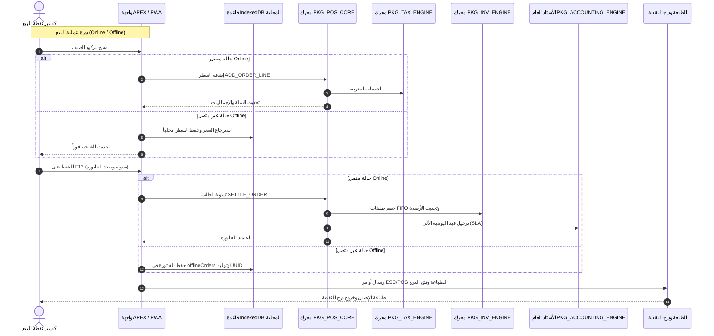

# 📚 موسوعة البنية المعمارية الشاملة لنظام Enterprise POS & ERP Suite
## Comprehensive Architecture & Technical Reference Guide (Phases 1 - 4)

---

## 🏛️ المرحلة الأولى: بنية قاعدة البيانات (Phase 1 — Database Architecture)

تتكون بنية قاعدة البيانات من **66 جدولاً** موزعة على 8 ملفات DDL معيارية متوافقة مع Oracle 12c / 19c / 23c وتتبع معايير Oracle E-Business Suite (EBS):

### 1. الهيكل الإداري متعدد الشركات (`ddl/01_multi_org_setup.sql`)
- **`POS_LEGAL_ENTITIES`**: الكيان القانوني للشركة الأم، الرقم الضريبي، وعملة الأساس.
- **`POS_OPERATING_UNITS`**: الإدارات الإقليمية والمكاتب المركزية.
- **`POS_INVENTORY_ORGS`**: المستودعات والفروع والمطابخ (وحدة عزل البيانات الأساسية ونظام التقييم FIFO/Average).
- **`POS_SUBINVENTORIES`**: مواقع التخزين الداخلية (رفوف البيع SHELF، المستودع الخلفي BACKSTORE، بضاعة الطريق TRANSIT).
- **`POS_POS_TERMINALS`**: أجهزة الكاشير ونقاط البيع وإعدادات طابعات الشبكة ESC/POS.
- **`POS_APP_USERS` & `POS_USER_ORG_ACCESS`**: المستخدمين وصلاحيات الفروع.
- **`POS_CTX` & `POS_ORG_SECURITY_POLICY`**: سياق الأمان وتطبيق سياسات Virtual Private Database (VPD) لعزل البيانات على مستوى الصفوف.

### 2. إدارة الأصناف والمخازن (`ddl/02_item_master.sql`)
- **`POS_UNITS_OF_MEASURE`**: وحدات القياس ومعاملات التحويل.
- **`POS_ITEM_CATEGORIES`**: شجرة المجموعات والتصنيفات اللانهائية وألوان الأزرار.
- **`POS_ITEMS`**: سجل الأصناف الرئيسي (السلع، الخدمات، الوجبات التجميعية BUNDLE، الإضافات MODIFIERS).
- **`POS_ITEM_ATTRIBUTES` & `POS_ATTRIBUTE_VALUES` & `POS_ITEM_VARIANTS`**: مصفوفة المتغيرات (Matrix Variants: المقاس، اللون) وتوليد الـ SKU المستقل.
- **`POS_ITEM_ORG_ASSIGN`**: تعيين الأصناف للفروع وسياسات إعادة الطلب.
- **`POS_LOT_SERIAL_CONTROL`**: إدارة الدفعات وتواريخ الصلاحية وأرقام السيريال.

### 3. التسعير، العروض ونقاط الولاء (`ddl/03_pricing_and_promotions.sql`)
- **`POS_PRICE_LISTS` & `POS_PRICE_LIST_LINES`**: جداول الأسعار الهرمية ذات الوراثة التلقائية وحدود الحد الأدنى للبيع.
- **`POS_CUSTOMER_PRICE_LIST`**: ربط فئات العملاء بأسعار خاصة.
- **`POS_PROMOTIONS` & `POS_PROMO_ITEMS`**: محرك العروض الترويجية (BXGY، الخصم الثابت، النسبة، التجميعي).
- **`POS_COUPONS`**: قسائم الخصم وتتبع مرات الاستخدام.
- **`POS_LOYALTY_*`**: برامج الولاء، حسابات العملاء، ودفتر أستاذ حركات النقاط (اكتساب / استبدال).

### 4. الطلبات والورديات والدفع (`ddl/04_orders_and_payments.sql`)
- **`POS_CUSTOMERS`**: العملاء والحدود الائتمانية والأرقام الضريبية.
- **`POS_SHIFTS` & `POS_SHIFT_CASH_MOVEMENTS`**: رقابة ورديات الكاشير، العهدة، والمطابقة العمياء (Blind Close)، وحركات سحب وتوريد النقدية.
- **`POS_TABLES`**: تخطيط طاولات وصالات قطاع المطاعم والكافيهات.
- **`POS_ORDERS` & `POS_ORDER_LINES`**: فواتير البيع والمرتجع، ومفتاح عدم التكرار الأوفلاين `OFFLINE_IDEMPOTENCY_KEY`.
- **`POS_PAYMENT_METHODS` & `POS_ORDER_PAYMENTS`**: طرق السداد المتعددة والدفع المجزأ (Split Tender).

### 5. حركات وتقييم المخزون (`ddl/05_inventory_transactions.sql`)
- **`POS_INVENTORY_BALANCES`**: الأرصدة اللحظية بالمخازن (الفعلي، المحجوز، وفي الطريق).
- **`POS_INVENTORY_TRANSACTIONS`**: دفتر أستاذ حركات المخزون غير القابل للتعديل (Immutable Ledger).
- **`POS_FIFO_COST_LAYERS`**: طبقات التكلفة بنظام الوارد أولاً يصرف أولاً (FIFO).
- **`POS_STOCK_TRANSFERS` & `POS_STOCK_TRANSFER_LINES`**: التحويلات بين الفروع وتتبع بضاعة الطريق.
- **`POS_CYCLE_COUNT_*`**: الجرد الدوري وحساب الفروقات آلياً عبر Virtual Generated Columns.

### 6. الحسابات العامة والأستاذ المساعد (`ddl/06_financials_gl_ar_ap.sql`)
- **`POS_COA_SEGMENTS` & `POS_COA_ACCOUNTS`**: دليل الحسابات المرن Flexfield.
- **`POS_GL_PERIODS`**: الفترات المالية وحالات الإغلاق الشهري والسنوي.
- **`POS_SLA_RULES`**: قواعد الترحيل المحاسبي الآلي للعمليات التشغيلية (Subledger Accounting).
- **`POS_GL_JOURNALS` & `POS_GL_JOURNAL_LINES`**: دفتر اليومية العامة.
- **`POS_AR_*` & `POS_AP_*`**: الأستاذ المساعد للعملاء وفواتير وسندات الموردين مع المطابقة الثلاثية 3-Way Matching.

### 7. محرك الضرائب والفاتورة الإلكترونية (`ddl/07_tax_engine.sql`)
- **`POS_TAX_REGIMES` & `POS_TAX_TYPES` & `POS_TAX_RATES`**: الأنظمة والنسب الضريبية.
- **`POS_TAX_RULES` & `POS_TAX_EXEMPTIONS`**: مصفوفة تطبيق الضريبة والإعفاءات.
- **`POS_ORDER_TAX_LINES`**: تفقيط أسطر الضريبة الشاملة وغير الشاملة.

### 8. المزامنة الأوفلاين والتدقيق (`ddl/08_offline_sync_and_audit.sql`)
- **`POS_OFFLINE_SYNC_QUEUE`**: طابور المزامنة للعمليات القادمة من الـ PWA.
- **`POS_SYNC_CONFLICT_LOG`**: سجل فض النزاعات وتوثيق الاختلافات.
- **`POS_AUDIT_LOG`**: سجل الرقابة والتدقيق الشامل لعمليات الإضافة والتعديل والحذف.
- **`POS_APP_SETTINGS` & `POS_PRINT_TEMPLATES`**: إعدادات النظام وقوالب الطباعة الحرارية.

---

## ⚙️ المرحلة الثانية: حزم المنطق المحاسبي والتجاري (Phase 2 — PL/SQL Packages)

تم بناء **5 حزم برمجية متقدمة (2,305 أسطر)**:

### 1. `PKG_POS_CORE` (محرك نقاط البيع الأساسي)
- `GENERATE_ORDER_NO`: توليد رقم الفاتورة التسلسلي `{ORG}-{YYYYMMDD}-{SEQ}`.
- `CREATE_ORDER`: إنشاء فاتورة مسودة والتحقق من فتح الوردية وحجز الطاولة.
- `ADD_ORDER_LINE`: إضافة صنف مع فحص صلاحية البيع، والبحث الهرمي عن السعر `GET_ITEM_PRICE`، وفحص الحد الأدنى للسعر.
- `CALCULATE_ORDER_TOTALS`: حساب الإجماليات وتطبيق تقريب الهللات لأقرب 0.05 ريال.
- `ADD_PAYMENT`: تسجيل المدفوعات المجزأة وحساب المتبقي والباقي للكاشير.
- `SETTLE_ORDER`: قفل الفاتورة `FOR UPDATE NOWAIT`، واعتماد الدفع، وتفعيل حركات المخزون والقيود المحاسبية، وتحديث مبيعات الوردية.
- `HOLD_ORDER` / `RECALL_ORDER` / `VOID_ORDER`: تعليق واسترجاع وإلغاء الفواتير.

### 2. `PKG_TAX_ENGINE` (محرك الضرائب الديناميكي)
- `DETERMINE_TAX_RATE`: تقييم مصفوفة الضرائب بحسب الأولوية (عميل معفى ➔ صنف ➔ مجموعة ➔ فرع ➔ نسبة قياسية).
- `CALCULATE_ORDER_TAX`: احتساب ضريبة كل سطر مع التمييز الدقيق بين الأسعار الشاملة وغير الشاملة للضريبة وتوزيعها في `POS_ORDER_TAX_LINES`.

### 3. `PKG_INV_ENGINE` (محرك المخزون والتقييم)
- `TRANSACT_INVENTORY`: تنفيذ حركات الصرف والإضافة مع التحديث اللحظي عبر `MERGE Upsert`.
- `FIFO_CONSUME_LAYERS`: استهلاك طبقات التكلفة الأقدم فالأحدث لحساب تكلفة المبيعات بدقة تامة.
- `RECALCULATE_AVERAGE_COST`: حساب المتوسط المرجح المتحرك الجديد بعد كل استلام.
- `PROCESS_ORDER_INVENTORY`: خصم مخزون الفاتورة بالكامل عند تسويتها.
- `CREATE_TRANSFER` / `SHIP_TRANSFER` / `RECEIVE_TRANSFER`: دورة التحويلات بين الفروع.

### 4. `PKG_ACCOUNTING_ENGINE` (محرك الترحيل المحاسبي SLA)
- `POST_SALE_JOURNAL`: إنشاء وترحيل قيد المبيعات المتوازن آلياً (مدين: الصندوق/البنك/العملاء، دائن: المبيعات، دائن: الضريبة، مدين: تكلفة المبيعات COGS، دائن: المخزون).
- `POST_SHIFT_RECONCILIATION`: ترحيل قيود معالجة فروقات عجز وزيادة الكاشير عند إقفال الوردية.

### 5. `PKG_OFFLINE_SYNC` (معالج المزامنة الأوفلاين)
- `RECEIVE_PAYLOAD`: استقبال حزمة الـ JSON والتأكد من عدم تكرارها عبر مفتاح `IDEMPOTENCY_KEY` وحساب بصمة `SHA-256`.
- `APPLY_ORDER_PAYLOAD`: تحليل الـ JSON بدوال أوراكل `JSON_TABLE` و `JSON_VALUE` وإنشاء الفواتير وتسويتها في النظام المركزي.
- `LOG_CONFLICT`: تسجيل أي تعارض في معاملة مستقلة `AUTONOMOUS_TRANSACTION`.

---

## 🌐 المرحلة الثالثة: العمل دون اتصال وتكامل الأجهزة (Phase 3 — PWA & Hardware)

تم بناء **5 ملفات جافاسكريبت متقدمة (61.3 KB)**:

### 1. `sw.js` (Service Worker)
- استراتيجيات تخزين هجينة: **Cache-First** للأصول الثابتة، و **Network-First** لخدمات الـ REST.
- دعم **Background Sync API** لإعادة محاولة إرسال الفواتير فور عودة الإنترنت.

### 2. `idb-manager.js` (IndexedDB Local Database)
- إدارة **10 مخازن بيانات محلية** لحفظ الكتالوج والأسعار والعملاء والفواتير الأوفلاين محلياً.
- دوال بحث سريعة في أقل من 5ms عبر الفهارس المركبة.
- توليد مفاتيح `UUID v4` للفواتير الأوفلاين.

### 3. `pos-sync.js` (محرك المزامنة الثنائي)
- `pullMasterData`: تنزيل التحديثات فقط (Incremental Pull) بعد آخر تاريخ مزامنة.
- `pushOfflineOrders`: إرسال الفواتير المعلقة مع التراجع الأسي (Exponential Backoff) عند تعثر الشبكة.
- `validatePriceConsistency`: فحص تطابق الأسعار الأوفلاين مع السيرفر وتوثيق الفروقات.

### 4. `escpos.js` (محرر أوامر الطباعة الحرارية)
- توليد البايتات الثنائية لأوامر الطابعات الحرارية (58mm / 80mm).
- طباعة الفواتير، وجداول المقارنة، والباركود، و **QR الفاتورة الإلكترونية المشفر (ZATCA TLV Base64)**.
- أوامر فتح درج النقدية التلقائي وقطع الورق، وتقارير الورديات X/Z Reports.

### 5. `pos-hardware.js` (الربط الفيزيائي مع العتاد)
- الاتصال المباشر عبر منافذ الشبكة (TCP Port 9100) ومنافذ **Web Serial API** و **Web USB API**.
- التوصيل مع شاشات العميل الخارجية (VFD Pole Display) لعرض الأسعار.
- قراءة الوزن اللحظي من الميزان الإلكتروني عبر المنفذ التسلسلي.
- تمييز قراءات ماسح الباركود الذكي عن الكتابة العادية عبر قياس سرعة النبضات (< 50ms).

---

## 🖥️ المرحلة الرابعة: واجهات أوراكل أيبكس (Phase 4 — APEX UI/UX)

تم توثيق مواصفات الشاشات والمكونات في مجلد `apex_specs/`:

### 1. `page_cashier_terminal.md` (شاشة الكاشير السريعة - Page 100 & 101)
- شاشة خالية من القوائم الجانبية ومجهزة للمس الكامل وشاشات نقاط البيع (10-15 بوصة).
- مصفوفة أزرار الاختصار السريعة:
  - `F1`: دفع نقدي فوري | `F2`: دفع شبكة/مدى | `F3`: دفع مجزأ (Page 101 Modal)
  - `F4`: تعليق فاتورة | `F5`: استرجاع فاتورة | `F6`: خصم سطر | `F7`: خصم إجمالي
  - `F8`: استعلام سعر | `F9`: تعديل كمية | `F10`: اختيار عميل | `F11`: اختيار طاولة
  - `F12`: اعتماد وطباعة وفتح الدرج فوراً.

### 2. `page_backoffice_admin.md` (شاشات الإدارة المركزية - Pages 200-250)
- **Page 200**: لوحة مؤشرات الأداء اللحظية (المبيعات، الورديات، الضرائب المحصلة، الركود).
- **Page 210**: شجرة المجموعات و Interactive Grid لكتالوج الأصناف ومصفوفة المتغيرات.
- **Page 220**: معالج بناء جداول الأسعار وقواعد العروض الترويجية.
- **Page 230**: شاشة إعدادات الـ SLA والربط المحاسبي مع الأستاذ العام.
- **Page 240**: إدارة التحويلات المخزنية ومطابقة الجرد الدوري.
- **Page 250**: تدقيق ورديات الكاشير، المطابقة العمياء، وسجل الحركات النقدية.

### 3. `apex_components.md` (المكونات المشتركة والبنية التحتية)
- عناصر التطبيق المشتركة (`F_APP_USER_ID`, `F_INV_ORG_ID`, `F_TERMINAL_ID`, ...).
- إجراء ما بعد المصادقة لضبط سياق الأمان `POS_CTX_PKG.SET_SESSION_CONTEXT`.
- قوائم الاختيار الديناميكية (Dynamic LOVs) المفلترة بحسب سياق الفرع.
- نقاط خدمات الـ ORDS REST APIs للمزامنة مع الـ PWA.

---

## 🔄 المخطط التكاملي العام للنظام (End-to-End Flow)

